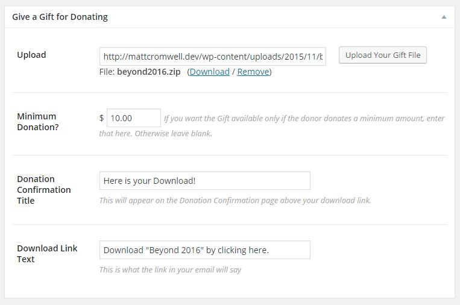
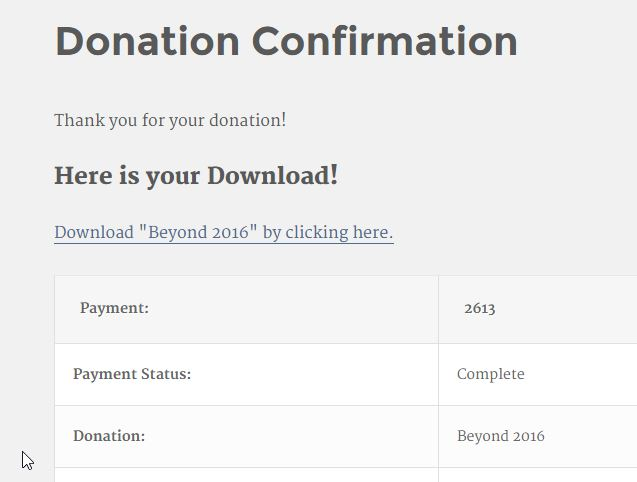
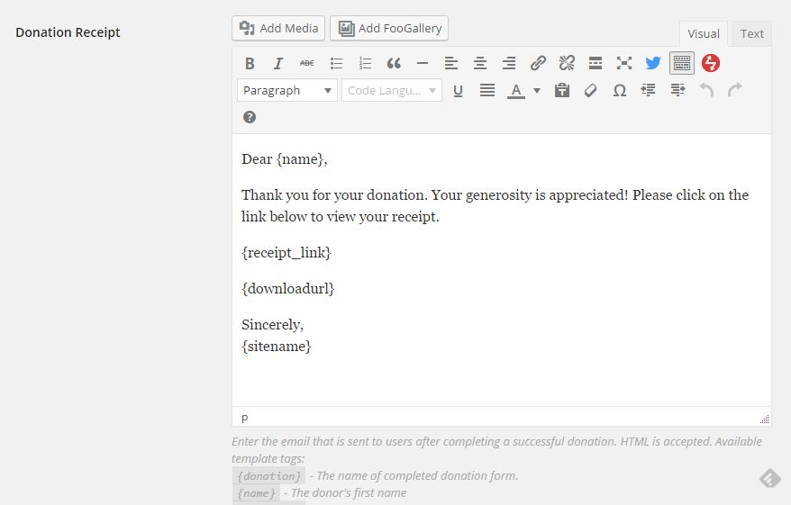
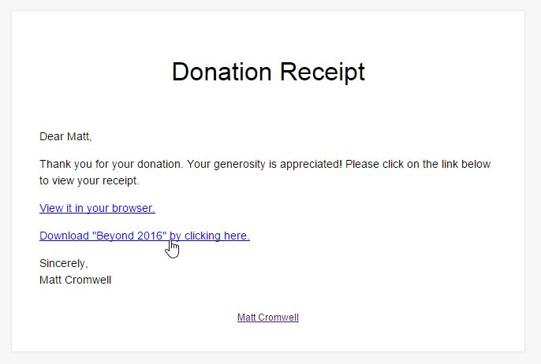

# Give a Gift for Donating
A [Give](https://givewp.com) Addon which allows you to add a file to any Give donation form and have it appear for your donors to download via the donation confirmation page and email confirmation.

## Features

* Choose custom title text for the confirmation page
* Choose custom link text for the download
* Upload your file via the Media Library Uploader
* Optionally set a minimum donation amount per form for the Gift to be available to the donor.
* Add the link to your Admin notification email and/or the Donor notification email via a custom Email tag.
* Forms that don't have uploads are not affected in any way.

## Screenshots

*Configure your Gift via the "Give a Gift for Donating" metabox on your Give form:*

*The Gift Title and Download link as seen on the Donation Confirmation page*

*Add the email tag {downloadurl} to your donation receipt email for your donors to download straight from their email*

*The Gift download link as seen in the Donor Email Receipt*

## About WordImpress

We build impressive Plugins for your WordPress website. Find out more about us and all our other great plugins at [https://wordimpress.com](https://wordimpress.com)

**HERE'S TO BUILDING THE WEB!**

